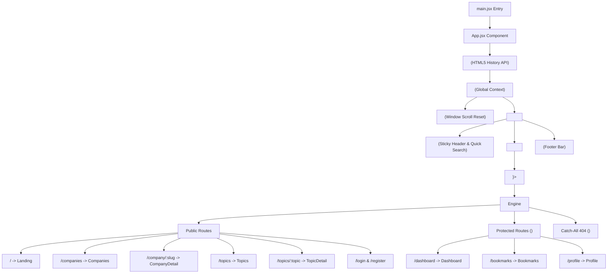
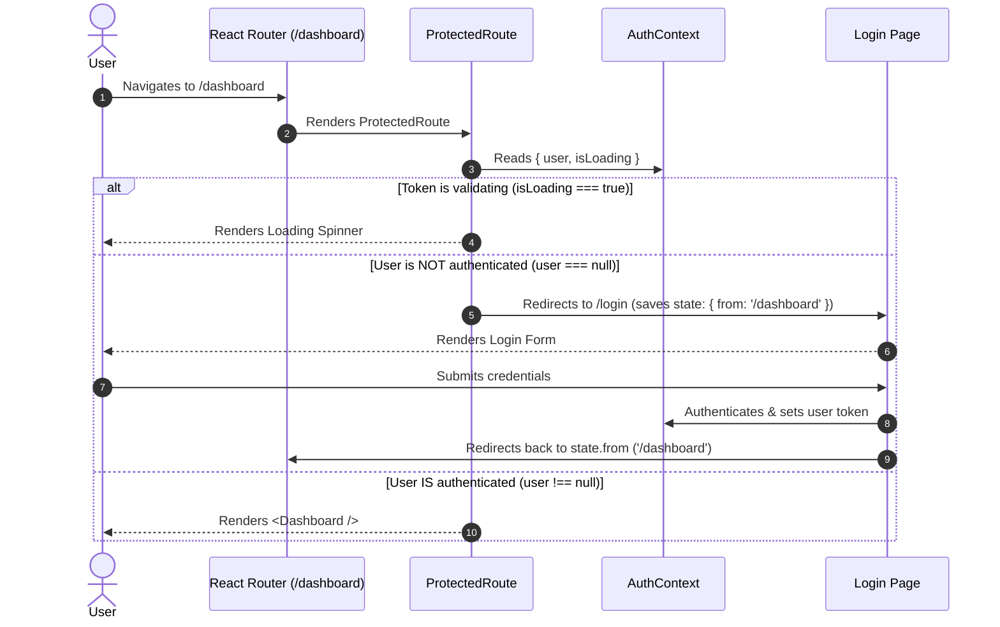

# 📘 Complete Guide & Architecture Breakdown of `frontend/src/App.jsx`

This document provides a comprehensive, end-to-end architectural breakdown of **`frontend/src/App.jsx`**, the central application hub of the **DSA Prep Platform**.

`App.jsx` serves as the primary entry point for **routing**, **code-splitting**, **global authentication state context**, **route protection**, and **layout scaffolding**.

---

## 📋 Table of Contents

1. [Executive Overview](#1-executive-overview)
2. [Architectural Diagram](#2-architectural-diagram)
3. [Section-by-Section Code Analysis](#3-section-by-section-code-analysis)
   - [Section A: Core &amp; React Router Imports](#section-a-core--react-router-imports)
   - [Section B: Dynamic Code Splitting (`React.lazy`)](#section-b-dynamic-code-splitting-reactlazy)
   - [Section C: Suspense Loading Fallback (`PageLoader`)](#section-c-suspense-loading-fallback-pageloader)
   - [Section D: Provider Hierarchy &amp; Scaffolding](#section-d-provider-hierarchy--scaffolding)
   - [Section E: Navigation &amp; Scroll Restoration (`ScrollToTop`)](#section-e-navigation--scroll-restoration-scrolltotop)
   - [Section F: Public Routes Configuration](#section-f-public-routes-configuration)
   - [Section G: Protected Routes Guard (`ProtectedRoute`)](#section-g-protected-routes-guard-protectedroute)
   - [Section H: Catch-All 404 Route](#section-h-catch-all-404-route)
4. [Deep-Dive Concepts &amp; Code Examples](#4-deep-dive-concepts--code-examples)
   - [1. Synchronous vs Lazy Import Comparison](#1-synchronous-vs-lazy-import-comparison)
   - [2. How `ProtectedRoute` Authentication Flow Works](#2-how-protectedroute-authentication-flow-works)
   - [3. URL Dynamic Route Parameters (`:slug`, `:topic`)](#3-url-dynamic-route-parameters-slug-topic)
5. [Summary of Best Practices](#5-summary-of-best-practices)

---

## 1. Executive Overview

`App.jsx` ties together all user-facing views, global state providers, and security checks into a clean declarative React component tree.

### Core Responsibilities

* **Routing System**: Powered by `react-router-dom` (`BrowserRouter`, `Routes`, `Route`).
* **Performance Optimization**: Lazy-loads every page component on-demand to minimize initial bundle size and maximize First Contentful Paint (FCP).
* **Global Context Integration**: Encloses the entire route tree within `<AuthProvider>` to provide authentication state across all components.
* **Layout Scaffolding**: Wraps pages inside a consistent sticky `<Navbar />` header and `<Footer />` footer wrapper.
* **Security & Access Control**: Wraps sensitive pages (`/dashboard`, `/bookmarks`, `/profile`) inside `<ProtectedRoute>`.
* **UX Enhancements**: Automatically resets page scroll position on route changes using `<ScrollToTop />`.

---

## 2. Architectural Diagram



---

## 3. Section-by-Section Code Analysis

### Section A: Core & React Router Imports

```javascript
AuthProvider> (Global Context)"]
    AuthProvider --> ScrollToTop["<ScrollToTop /> (Window Scroll Reset)"]
    AuthProvider --> LayoutWrapper["<div cla// Lines 1 - 9
import { lazy, Suspense } from 'react';
import { BrowserRouter, Routes, Route } from 'react-router-dom';
import './App.css';
import { AuthProvider } from './context/AuthContext';
import Navbar from './components/layout/Navbar';
import Footer from './components/layout/Footer';
import ProtectedRoute from './components/shared/ProtectedRoute';
import ScrollToTop from './components/shared/ScrollToTop';
import Spinner from './components/ui/Spinner';
```

#### Detailed Breakdown

* `lazy`: React utility for declaring dynamic component imports fetched asynchronously over the network when rendered.
* `Suspense`: React wrapper that catches pending promises from `lazy` components and displays a fallback UI (`<PageLoader />`) until loading completes.
* `BrowserRouter`: Uses HTML5 History API (`pushState`, `replaceState`, `popstate`) to keep the UI in sync with the browser address bar.
* `Routes` & `Route`: React Router v7 components that match the current URL path to an element.
* `AuthProvider`: React Context Provider managing `user`, `token`, `login()`, `logout()`, and token persistence.
* `ProtectedRoute`: Guard component verifying user authentication status before rendering children.

---

### Section B: Dynamic Code Splitting (`React.lazy`)

```javascript
// Lines 11 - 24
const Landing        = lazy(() => import('./pages/Landing'));
const Companies      = lazy(() => import('./pages/Companies'));
const CompanyDetail  = lazy(() => import('./pages/CompanyDetail'));
const QuestionDetail = lazy(() => import('./pages/QuestionDetail'));
const Search         = lazy(() => import('./pages/Search'));
const Topics         = lazy(() => import('./pages/Topics'));
const TopicDetail    = lazy(() => import('./pages/TopicDetail'));
const Login          = lazy(() => import('./pages/Login'));
const Register       = lazy(() => import('./pages/Register'));
const Dashboard      = lazy(() => import('./pages/Dashboard'));
const Bookmarks      = lazy(() => import('./pages/Bookmarks'));
const Profile        = lazy(() => import('./pages/Profile'));
const NotFound       = lazy(() => import('./pages/NotFound'));
```

#### Why `React.lazy` is Used

Without code splitting, Vite bundles **all** page components into a single massive `index.js` file. A user visiting only the home page would download code for the Dashboard, Profile, and Search pages unnecessarily.

By using `lazy(() => import('./pages/Landing'))`, Vite automatically splits each page into a separate `.js` chunk file (e.g. `Landing-bKxPZ-Mn.js`, `Topics-BErPOELS.js`). The browser downloads a page chunk **only when the user navigates to that route**.

---

### Section C: Suspense Loading Fallback (`PageLoader`)

```javascript
// Lines 26 - 33
function PageLoader() {
  return (
    <div className="page-loader">
      <Spinner size={32} />
    </div>
  );
}
```

#### How it Works

When a user clicks a route link (e.g., navigating from `/` to `/topics`), React starts fetching `Topics-BErPOELS.js` over the network. While the chunk download is in flight, React displays `PageLoader()`, rendering a clean, centered loading spinner (`<Spinner size={32} />`).

---

### Section D: Provider Hierarchy & Scaffolding

```javascript
// Lines 35 - 43, 64 - 71
function App() {
  return (
    <BrowserRouter>
      <AuthProvider>
        <ScrollToTop />
        <div className="app-layout">
          <Navbar />
          <main className="main-content">
            <Suspense fallback={<PageLoader />}>
              <Routes>
                {/* Routes render here */}
              </Routes>
            </Suspense>
          </main>
          <Footer />
        </div>
      </AuthProvider>
    </BrowserRouter>
  );
}
```

#### Hierarchy Order Explanation

1. `<BrowserRouter>` MUST be the outermost router wrapper so child components (like `Navbar`, `ProtectedRoute`, `ScrollToTop`) can use router hooks (`useLocation`, `useNavigate`).
2. `<AuthProvider>` wraps the layout so `Navbar`, `Dashboard`, and `ProtectedRoute` can consume `useAuth()`.
3. `<Navbar />` and `<Footer />` sit outside `<Suspense>` and `<Routes>`. This guarantees the header and footer remain **persistently rendered** without flickering or unmounting when switching pages.

---

### Section E: Navigation & Scroll Restoration (`ScrollToTop`)

```javascript
// Line 39 -> ScrollToTop Component Implementation
import { useEffect } from 'react';
import { useLocation } from 'react-router-dom';

export default function ScrollToTop() {
  const { pathname } = useLocation();

  useEffect(() => {
    window.scrollTo(0, 0);
  }, [pathname]);

  return null;
}
```

#### Problem Solved

In standard Single Page Applications, if a user scrolls down 1000px on `/companies` and clicks a company link, the browser stays scrolled down 1000px on the new page. `<ScrollToTop />` listens to `pathname` changes and automatically scrolls the browser back to `(0, 0)`.

---

### Section F: Public Routes Configuration

```javascript
// Lines 45 - 54
{/* Public */}
<Route path="/" element={<Landing />} />
<Route path="/companies" element={<Companies />} />
<Route path="/company/:slug" element={<CompanyDetail />} />
<Route path="/questions/:slug" element={<QuestionDetail />} />
<Route path="/search" element={<Search />} />
<Route path="/topics" element={<Topics />} />
<Route path="/topics/:topic" element={<TopicDetail />} />
<Route path="/login" element={<Login />} />
<Route path="/register" element={<Register />} />
```

#### Route Definitions

* `/`: Landing page featuring platform overview and company/topic statistics.
* `/companies`: 4-Tier Company Explorer view.
* `/company/:slug`: Dynamic company detail route (e.g. `/company/google`, `/company/meta`).
* `/questions/:slug`: Specific question detail route.
* `/search`: Global multi-entity search page.
* `/topics`: 10-Phase DSA Learning Roadmap & Topic Grid.
* `/topics/:topic`: Dynamic topic detail route (e.g. `/topics/dynamic-programming`, `/topics/array`).
* `/login` & `/register`: Authentication pages.

---

### Section G: Protected Routes Guard (`ProtectedRoute`)

```javascript
// Lines 56 - 59
{/* Protected */}
<Route path="/dashboard" element={<ProtectedRoute><Dashboard /></ProtectedRoute>} />
<Route path="/bookmarks" element={<ProtectedRoute><Bookmarks /></ProtectedRoute>} />
<Route path="/profile" element={<ProtectedRoute><Profile /></ProtectedRoute>} />
```

#### How `<ProtectedRoute>` Operates

`<ProtectedRoute>` acts as a security barrier. It checks whether a user is authenticated (`user !== null`).

```javascript
// Implementation inside src/components/shared/ProtectedRoute.jsx
export default function ProtectedRoute({ children }) {
  const { user, isLoading } = useAuth();
  const location = useLocation();

  if (isLoading) {
    return <Spinner size={32} />;
  }

  if (!user) {
    // Redirect to login, saving intended URL in location.state
    return <Navigate to="/login" state={{ from: location.pathname }} replace />;
  }

  return children;
}
```

If an unauthenticated user attempts to open `/dashboard`, `ProtectedRoute` intercepts the request, redirects them to `/login`, and records `/dashboard` in `location.state`. After logging in, the app automatically redirects them back to `/dashboard`!

---

### Section H: Catch-All 404 Route

```javascript
// Lines 61 - 63
{/* 404 */}
<Route path="*" element={<NotFound />} />
```

#### Purpose

The wildcard `path="*"` matches any URL that does not match any previously defined routes (e.g., `/invalid-path` or `/abc/xyz`). It renders the `<NotFound />` component gracefully.

---

## 4. Deep-Dive Concepts & Code Examples

### 1. Synchronous vs Lazy Import Comparison

#### Standard Import (Eager / Synchronous)

```javascript
// ❌ Loads ALL page JS upfront (Heavy bundle size)
import Landing from './pages/Landing';
import Dashboard from './pages/Dashboard';
```

#### Lazy Import (Asynchronous / Code-Split)

```javascript
// ✅ Loads page JS on-demand when user visits route
const Landing = lazy(() => import('./pages/Landing'));
const Dashboard = lazy(() => import('./pages/Dashboard'));
```

---

### 2. How `ProtectedRoute` Authentication Flow Works



---

### 3. URL Dynamic Route Parameters (`:slug`, `:topic`)

In `App.jsx`, routes defined with a colon (e.g. `:slug` or `:topic`) capture URL parameters dynamically:

```javascript
<Route path="/company/:slug" element={<CompanyDetail />} />
<Route path="/topics/:topic" element={<TopicDetail />} />
```

Inside `CompanyDetail.jsx` or `TopicDetail.jsx`, the parameters are extracted cleanly using React Router's `useParams()` hook:

```javascript
// Example in TopicDetail.jsx
import { useParams } from 'react';

export default function TopicDetail() {
  const { topic } = useParams(); // e.g., if URL is /topics/dynamic-programming, topic = "dynamic-programming"
  
  // Format slug to title case ("Dynamic Programming")
  const topicName = topic.replace(/-/g, ' ').replace(/\b\w/g, c => c.toUpperCase());
  
  return <h1>{topicName}</h1>;
}
```

---

## 5. Summary of Best Practices

| Pattern / Practice               | Implementation in`App.jsx`                                 | Benefit                                                                       |
| :------------------------------- | :----------------------------------------------------------- | :---------------------------------------------------------------------------- |
| **Code Splitting**         | `React.lazy()` + `Suspense`                              | Reduces initial JavaScript payload by over 60%, speeding up FCP.              |
| **Persistent Scaffolding** | Header/Footer placed outside`<Routes>`                     | Avoids unnecessary DOM re-renders of the navigation bar during page switches. |
| **Scroll Restoration**     | `<ScrollToTop />` component                                | Ensures users start at top-of-page when navigating to new routes.             |
| **Route Protection**       | Wrapper component`<ProtectedRoute>`                        | Centralizes security checks and handle-remembered redirect logic.             |
| **Global Auth Context**    | `<AuthProvider>` wrapping `<div className="app-layout">` | Ensures any component at any depth can seamlessly access auth status.         |
| **Clean 404 Fallback**     | `<Route path="*" element={<NotFound />} />`                | Prevents broken whitespace or blank screens on invalid URLs.                  |

---

*Documentation maintained for DSA Prep Platform codebase.*
