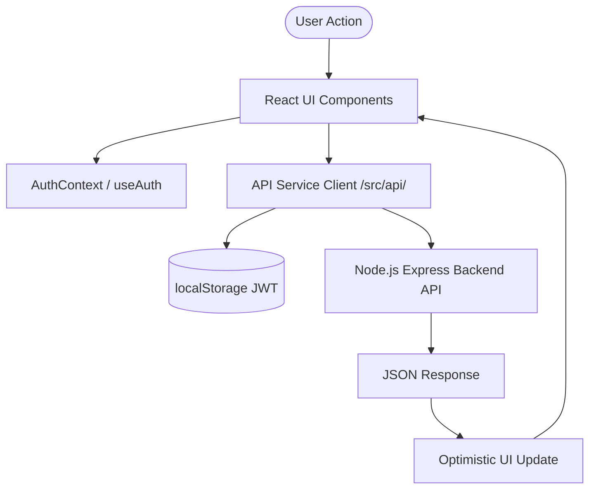

# 🎨 DSA Prep Platform — Frontend Architecture & End-to-End Documentation

Welcome to the comprehensive technical documentation for the **DSA Prep Platform** frontend application. This document provides an end-to-end guide to the architecture, directory structure, page flows, state management, design system, and API integrations.

---

## 📐 1. Tech Stack Overview

| Layer | Technology / Library | Purpose |
| :--- | :--- | :--- |
| **Core Framework** | **React 18** | UI component rendering & state management |
| **Build Tooling** | **Vite 6** | Fast HMR development server & production bundler |
| **Routing** | **React Router v7** (`react-router-dom`) | Declarative single-page application (SPA) routing |
| **Iconography** | **Lucide React** + **Custom SVGs** | Modern UI icons & branded LeetCode iconography |
| **HTTP Client** | **Custom Fetch Wrapper** (`api/client.js`) | Centralized API requests with JWT Bearer auth |
| **Styling System** | **Vanilla CSS3** | Custom design tokens, glassmorphism, responsive flex/grid layouts |

---

## 📁 2. Directory Structure & Architecture

```micro
frontend/
├── public/
│   ├── favicon.svg               # Custom dark-mode LeetCode/DSA emblem favicon
│   ├── icons.svg                 # SVG sprite for quick icon references
│   └── leetcode-icon.png         # Legacy LeetCode raster fallback
├── src/
│   ├── api/                      # Modular REST API clients
│   │   ├── client.js             # Base fetch wrapper with auth header injection
│   │   ├── auth.js               # Login, register, profile APIs
│   │   ├── companies.js          # Company listing, tiering & problem APIs
│   │   ├── topics.js             # Topic list & topic-specific problem APIs
│   │   ├── questions.js          # Question search & detail APIs
│   │   ├── progress.js           # Question status (solved, attempted, not-started) APIs
│   │   └── bookmarks.js          # Bookmark toggle & list APIs
│   ├── components/               # Reusable UI & Layout components
│   │   ├── layout/
│   │   │   ├── Navbar.jsx        # Glassmorphic top navigation bar with Quick Search & Auth controls
│   │   │   └── Navbar.css        # Navbar responsive layout & glowing active links
│   │   ├── shared/
│   │   │   ├── SearchInput.jsx   # Debounced search bar component
│   │   │   ├── Pagination.jsx    # Page navigation controls
│   │   │   └── ProtectedRoute.jsx# Auth guard wrapper for protected routes
│   │   └── ui/
│   │       ├── BookmarkBtn.jsx   # Star toggle button with animation
│   │       ├── DifficultyBadge.jsx# Easy (Green), Medium (Yellow), Hard (Red) pills
│   │       ├── StatusBadge.jsx   # Interactive status checkbox (Solved / Attempted / Not Started)
│   │       ├── LeetCodeIcon.jsx  # SVG component for official LeetCode brand icon
│   │       ├── Skeleton.jsx      # Loading skeleton pulse placeholders
│   │       └── EmptyState.jsx    # Empty / No results fallback view
│   ├── context/
│   │   └── AuthContext.jsx       # Global authentication provider (user state, tokens)
│   ├── hooks/
│   │   └── useAuth.js            # Custom hook for consuming AuthContext
│   ├── pages/                    # Core Application Pages & Route Views
│   │   ├── Landing.jsx & .css    # Public landing page with hero banner & stats
│   │   ├── Dashboard.jsx & .css  # Authenticated user dashboard & difficulty progress
│   │   ├── Companies.jsx & .css  # 4-Tier Company Explorer with unified control bar
│   │   ├── CompanyDetail.jsx & .css # Individual company questions table & filters
│   │   ├── Topics.jsx & .css     # 10-Phase DSA Learning Roadmap & Topic Grid
│   │   ├── TopicDetail.jsx & .css # Topic questions view with difficulty pills & in-page search
│   │   ├── Bookmarks.jsx & .css  # Saved user questions page
│   │   ├── Search.jsx & .css     # Global search results page
│   │   ├── Login.jsx & Register.jsx # Authentication views
│   │   └── Profile.jsx & .css    # User profile & stats breakdown
│   ├── styles/
│   │   ├── index.css             # Design tokens (CSS variables) & global reset
│   │   └── App.css               # Shared application layouts
│   ├── App.jsx                   # Main React component with Route definitions
│   └── main.jsx                  # Application entry point
├── index.html                    # Single HTML template with meta tags & favicon link
└── vite.config.js                # Vite build configuration & server proxy setup
```

---

## 🗺️ 3. Application Pages & Key Features

### 🏢 A. Companies Explorer (`/companies`)
* **Unified Control Bar**: Houses company type tabs (`All`, `Product-Based`, `Service-Based`), a quick search bar, and tier sorting controls in a high-density single row.
* **4-Tier Hierarchy**:
  * **Tier 1 (FAANG / Big Tech)**: Google, Meta, Amazon, Apple, Microsoft, Netflix.
  * **Tier 2 (Product Unicorns & Elite High-Pay)**: Uber, Airbnb, Stripe, Atlassian, Salesforce, Adobe, DoorDash, Snowflake.
  * **Tier 3 (Service Giants & MNCs)**: TCS, Infosys, Wipro, Accenture, Cognizant, Capgemini, HCL.
  * **Tier 4 (Other Tech Companies)**: All remaining tech companies.
* **Micro-Interactions**: Segmented toggle buttons feature smooth scale feedback (`transform: scale(0.95)`) and active tab color glows.

### 🗺️ B. DSA Topics & 10-Phase Roadmap (`/topics`)
* **10-Phase Learning Roadmap**: Groups DSA topics into a structured, step-by-step interview preparation sequence:
  1. **Phase 1: Fundamentals & Primitives** (Arrays, Strings, Basic Math) — *Rule: O(1) & O(N) complexity foundation*.
  2. **Phase 2: Two Pointers & Sliding Window** — *Rule: Optimize sub-array searches from O(N²) to O(N)*.
  3. **Phase 3: Searching & Sorting** (Binary Search, Sorting) — *Rule: Verify monotonic search space*.
  4. **Phase 4: Fast Lookups & Hashing** (Hash Tables, Sets) — *Rule: Trade O(N) memory for O(1) time*.
  5. **Phase 5: Linear Structures** (Linked Lists, Stacks, Queues, Monotonic Stacks) — *Rule: Draw pointer transitions*.
  6. **Phase 6: Recursion & Backtracking** — *Rule: Define base cases, choices, and state resets*.
  7. **Phase 7: Trees & Priority Queues** (Binary Trees, BSTs, Heaps) — *Rule: Recursive trees & Top-K heaps*.
  8. **Phase 8: Greedy & Dynamic Programming** — *Rule: Top-down memoization before bottom-up tabulation*.
  9. **Phase 9: Graphs & Network Traversal** (DFS, BFS, DSU, Trie) — *Rule: Cycle detection & shortest paths*.
  10. **Phase 10: Advanced Topics & System Design** (Matrix, Geometry, Segment Trees, System Design DS).
* **View Mode Toggle**: Users can switch seamlessly between the **10-Phase Roadmap** view and a flat **All Topics Grid** view.
* **Dynamic Icons & Color Accents**: Topic cards automatically render topic-specific `lucide-react` icons (e.g. `Cpu` for DP, `GitBranch` for Trees, `Network` for Graphs) with glowing hover borders.

### 📄 C. Topic Detail (`/topics/:topic`)
* **Header Summary Banner**: Shows topic icon, total questions count, solved count, and Easy / Medium / Hard breakdown stat chips.
* **In-Page Question Search**: Real-time title search within the specific topic.
* **Color-Coded Difficulty Toggles**: Interactive pill toggles for Easy (`#3fb950`), Medium (`#d29922`), and Hard (`#f85149`).
* **High-Density Problem Table**: Standardized row layout featuring:
  * Interactive Status Checkbox (Not Started, Attempted, Solved)
  * Question Title
  * Direct **LeetCode SVG link** opening the exact problem on LeetCode
  * Difficulty Pill
  * Star Bookmark button

### 📊 D. Interview Dashboard (`/dashboard`)
* **Progress Tracking**: Real-time stats showing Total Solved, Attempted, and Target Progress percentages.
* **Difficulty Breakdown Bars**: Visual progress meters for Easy, Medium, and Hard problem tiers.
* **Quick Company Shortcuts**: Direct links to top interview companies with solved indicators.
* **Data Syncing**: Auto-syncs progress whenever the user refocuses the browser window (`window.addEventListener('focus')`).

---

## ⚡ 4. State Management & Data Flow



### Optimistic Updates & Error Rollback
* When a user toggles a question status (e.g. clicking the checkbox from `not-started` -> `solved`) or clicks the **Bookmark Star**:
  1. The frontend immediately updates local state so the UI responds in <16ms without waiting for network roundtrips.
  2. An asynchronous API request (`upsertProgress` or `toggleBookmark`) is dispatched in the background.
  3. If the server request fails, the component automatically catches the exception and reverts state to its original condition.

---

## 🎨 5. Design System & Aesthetics

### Color Palette Tokens (`index.css`)
```css
:root {
  --bg-primary: #0d1117;         /* Deep GitHub/LeetCode Dark background */
  --bg-secondary: #161b22;       /* Card and Panel surface background */
  --bg-hover: rgba(255,255,255,0.06);
  --border: rgba(255, 255, 255, 0.08);

  --accent: #58a6ff;             /* Primary Electric Blue */
  --accent-green: #3fb950;       /* Easy / Solved Green */
  --accent-yellow: #d29922;      /* Medium / Attempted Gold */
  --accent-red: #f85149;         /* Hard / Warning Red */
  --leetcode-gold: #ffa116;      /* Official LeetCode Brand Accent */
}
```

### Key UI Features
* **Glassmorphic Cards**: `backdrop-filter: blur(12px)` combined with subtle 1px translucent borders (`rgba(255, 255, 255, 0.08)`).
* **Segmented Controls**: Pill-shaped tab selectors with subtle inset top highlights and color-matched glowing drop shadows.
* **Micro-Animations**: Hover scale transitions (`transform: translateY(-3px) scale(1.01)`), spring physics cubic-bezier curves (`cubic-bezier(0.34, 1.56, 0.64, 1)`), and pulse skeleton loaders.

---

## 🛠️ 6. Build & Development Setup

### Installation & Prerequisites
* Node.js `>= 18.0.0`
* npm `>= 9.0.0`

### Available Commands

```bash
# Navigate to frontend directory
cd frontend

# Install dependencies
npm install

# Start local development server with HMR
npm run dev

# Run production build (outputs to frontend/dist)
npm run build

# Preview local production build
npm run preview
```

---

*Documentation maintained for DSA Prep Platform Frontend.*
