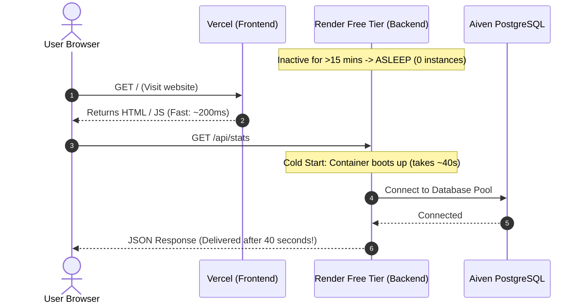
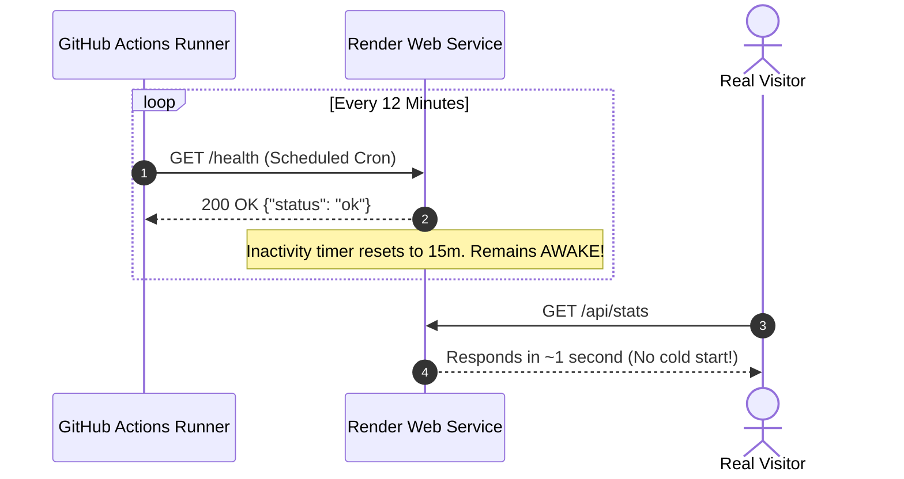

# Render Backend Keep-Alive Guide (Preventing Cold Starts)

This document explains the root cause of the **40–50 second delay** when loading the site and details the automated **GitHub Actions Keep-Alive** workflow implemented to keep the Render backend awake 24/7 for free.

---

## 🛑 1. The Root Cause: Render Free-Tier "Cold Start"

### What was happening?
1. The frontend ([`https://dsa-preparation-platform.vercel.app`](https://dsa-preparation-platform.vercel.app)) is hosted on **Vercel**, which serves static HTML/JS globally in `< 500ms`.
2. The backend Express API ([`https://dsa-prep-backend.onrender.com`](https://dsa-prep-backend.onrender.com)) is hosted on **Render's Free Tier**.
3. Render automatically puts free web services to sleep (spins down the container to 0 instances) after **15 minutes of inactivity**.
4. When a user opens the site after 15 minutes:
   - The browser makes API requests (`/api/stats`, `/api/companies/featured`).
   - Render detects incoming HTTP traffic and starts booting the container from scratch.
   - Container boot + Node.js startup + Prisma database connection takes **39 to 50+ seconds**.
   - During this time, the user stares at grey skeleton loaders thinking the site is broken.



---

## ⚡ 2. The Solution: Automated Keep-Alive Workflow

Render only goes to sleep if **15 consecutive minutes** pass without any incoming HTTP requests.

By pinging the lightweight [`/health`](file:///home/a-raghavendra/Desktop/github_repos/Project%20DSA/backend/src/app.js#L94) endpoint every **12 minutes**, Render's inactivity countdown timer is reset every cycle. **The container never sleeps, so visitors get instantaneous responses (~1 second).**



---

## 💰 3. Will This Exceed Free Tier Limits?

### Render Free Tier Hours:
- Render grants **750 free instance hours per calendar month**.
- A 31-day month has: `31 days × 24 hours = 744 hours`.
- Since `744 hours < 750 hours`, **1 free web service running 24/7 stays 100% within Render's free tier**.

### GitHub Actions Minutes:
- GitHub Actions provides **unlimited minutes for public repositories**.
- For private repositories, free accounts get 2,000 minutes/month. Each ping takes ~5 seconds (less than 1 minute of billed time).

---

## 🛠️ 4. Workflow File Details

The workflow is located at [`.github/workflows/keep-alive.yml`](file:///home/a-raghavendra/Desktop/github_repos/Project%20DSA/.github/workflows/keep-alive.yml):

```yaml
name: Keep Render Backend Awake

on:
  schedule:
    # Runs every 12 minutes to prevent Render's 15-minute inactivity spin-down
    - cron: '*/12 * * * *'
  workflow_dispatch: # Allows manual trigger from GitHub Actions tab anytime

jobs:
  keep-alive:
    name: Ping Render Health Check
    runs-on: ubuntu-latest
    timeout-minutes: 5

    steps:
      - name: Ping Backend Endpoint
        run: |
          echo "Sending keep-alive ping to Render backend..."
          TIMESTAMP=$(date -u +"%Y-%m-%d %H:%M:%S UTC")
          
          # Curl health endpoint with a 45s timeout in case of initial wake-up
          HTTP_STATUS=$(curl -s -o /dev/null -w "%{http_code}" --max-time 45 "https://dsa-prep-backend.onrender.com/health")
          
          echo "[$TIMESTAMP] Ping finished with HTTP status: $HTTP_STATUS"
          
          if [ "$HTTP_STATUS" -eq 200 ]; then
            echo "✅ Render backend is awake and healthy."
          else
            echo "⚠️ Health check returned non-200 code ($HTTP_STATUS). Backend might still be starting or unreachable."
          fi
```

### Key Workflow Features:
1. **Cron (`*/12 * * * *`)**: Pings every 12 minutes (well inside Render's 15-minute window).
2. **Lightweight Target (`/health`)**: Hits `GET /health` in [`backend/src/app.js`](file:///home/a-raghavendra/Desktop/github_repos/Project%20DSA/backend/src/app.js#L94), which responds with `{ "status": "ok" }` in milliseconds without touching database queries.
3. **`workflow_dispatch`**: Lets you manually trigger the ping anytime from GitHub’s web interface to verify it works immediately.
4. **45-second timeout window**: Accommodates any first-time boot delay without failing the action prematurely.

---

## 🚀 5. How to Activate and Verify on GitHub

Follow these steps to enable the workflow:

### Step 1: Commit and Push to GitHub
Run in your terminal:
```bash
git add .github/workflows/keep-alive.yml RENDER_KEEP_ALIVE_SETUP.md
git commit -m "ci: add GitHub Actions keep-alive workflow for Render backend"
git push origin main
```

### Step 2: Verify in GitHub
1. Open your repository on **[github.com](https://github.com)**.
2. Click on the **Actions** tab at the top.
3. In the left sidebar, click **"Keep Render Backend Awake"**.
4. To test it immediately:
   - Click the **"Run workflow"** dropdown button on the right.
   - Click the green **"Run workflow"** button.
5. In ~15 seconds, you will see a green checkmark `✅` showing:
   ```text
   [2026-09-30 18:00:00 UTC] Ping finished with HTTP status: 200
   ✅ Render backend is awake and healthy.
   ```

---

## 📌 6. Important GitHub Caveats & Best Practices

1. **GitHub Inactivity Policy (60 Days):**  
   GitHub automatically pauses scheduled workflows if a repository has had **no commits or activity for 60 consecutive days**.  
   - If that happens, GitHub sends an email notification. You can re-enable it with one click under the **Actions** tab.
2. **Optional Redundancy (Zero-Maintenance Alternative):**  
   If you want a 100% "set-it-and-forget-it" backup that never pauses even if the repo is untouched:
   - Sign up at **[cron-job.org](https://cron-job.org)** (free).
   - Create a cron job pointing to `https://dsa-prep-backend.onrender.com/health` every 12 minutes.
   - Having both guarantees 100% uptime with zero maintenance.
