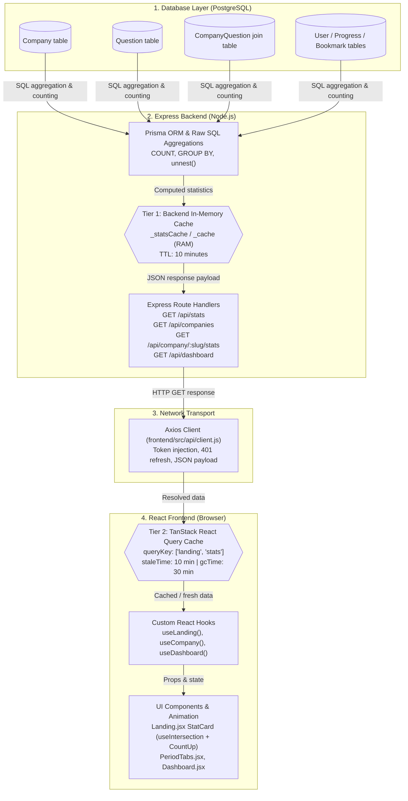

# End-to-End Explanation: Stats Pipeline & Multi-Tier Caching Architecture

This document provides a comprehensive technical breakdown of **how statistics flow into the platform** (from PostgreSQL database tables up to the React user interface) and **how data is cached across the backend and frontend**.

---

## 🏗️ High-Level Architecture Flow



---

## 1. The Different Types of Stats on the Platform

The platform handles four distinct categories of statistics:

| Category                 | API Endpoint                     | Description                                                                                                     | Cache Strategy                               |
| :----------------------- | :------------------------------- | :-------------------------------------------------------------------------------------------------------------- | :------------------------------------------- |
| **Platform Stats** | `GET /api/stats`               | Global counts: total companies, questions, users, topics, difficulty breakdown.                                 | 10 min Backend RAM + 10 min React Query      |
| **Company Counts** | `GET /api/companies`           | List of all companies with individual`questionCount` and top 5 topics.                                        | 10 min Backend RAM + 10 min React Query      |
| **Company Stats**  | `GET /api/company/:slug/stats` | Per-company question counts by timeframe period (`30days`, `3months`, `6months`, `all`) and difficulty. | React Query (`['company', slug, 'stats']`) |
| **User Dashboard** | `GET /api/dashboard`           | User-specific solved count, attempted count, bookmarks count, top topics.                                       | Authenticated query + Optimistic updates     |

---

## 2. How Stats Come into the Site (Step-by-Step)

Let us trace the journey of **Platform Stats** (`/api/stats`) from database to screen:

### Step 1: Database Aggregation via Prisma

In [`backend/src/routes/stats.js`](<file:///home/a-raghavendra/Desktop/github_repos/Project%20DSA/backend/src/routes/stats.js#L16-L40>), the backend computes platform figures using PostgreSQL queries:

```javascript
// 1. Total counts for companies, questions, and users in parallel
const [companies, questions, users] = await Promise.all([
  prisma.company.count(),
  prisma.question.count(),
  prisma.user.count(),
]);

// 2. Breakdown by difficulty (EASY, MEDIUM, HARD)
const byDiff = await prisma.question.groupBy({
  by: ['difficulty'],
  _count: { id: true },
});

// 3. Count unique topics across all questions
const allQuestions = await prisma.question.findMany({ select: { topics: true } });
const topicMap = {};
allQuestions.forEach(q => q.topics.forEach(t => topicMap[t] = (topicMap[t] || 0) + 1));
```

### Step 2: Route Serializes JSON

The route constructs the response payload:

```json
{
  "success": true,
  "stats": {
    "totalCompanies": 429,
    "totalQuestions": 3392,
    "totalUsers": 120,
    "totalTopics": 173,
    "lastUpdated": "2026-09-19T17:27:00.000Z",
    "difficultyBreakdown": {
      "EASY": 810,
      "MEDIUM": 1720,
      "HARD": 862
    }
  }
}
```

### Step 3: Network Transport & Client Handling

The frontend communicates via Axios:

- [`frontend/src/api/client.js`](<file:///home/a-raghavendra/Desktop/github_repos/Project%20DSA/frontend/src/api/client.js>): Provides a central Axios client. It automatically injects JWT Bearer tokens if logged in, handles 401 token refreshes silently, and normalizes errors.
- [`frontend/src/api/stats.js`](<file:///home/a-raghavendra/Desktop/github_repos/Project%20DSA/frontend/src/api/stats.js>):
  ```javascript
  export const getStats = () => api.get('/api/stats');
  ```

### Step 4: React Query Custom Hook

In [`frontend/src/hooks/useLanding.js`](<file:///home/a-raghavendra/Desktop/github_repos/Project%20DSA/frontend/src/hooks/useLanding.js#L21-L30>):

```javascript
export function useLanding() {
  const statsQuery = useQuery({
    queryKey: ['landing', 'stats'],
    queryFn: async () => {
      const res = await getStats();
      return res.stats ?? res;
    },
    staleTime: 1000 * 60 * 10, // 10 minutes
    gcTime:    1000 * 60 * 30, // 30 minutes
  });

  return {
    stats:   statsQuery.data ?? null,
    loading: statsQuery.isPending,
    error:   statsQuery.isError ? statsQuery.error.message : null,
  };
}
```

### Step 5: Presentation & Scroll Animation

In [`frontend/src/pages/Landing.jsx`](<file:///home/a-raghavendra/Desktop/github_repos/Project%20DSA/frontend/src/pages/Landing.jsx#L147-L207>):

1. **Loading State**: While `loading` is true, 4 animated skeleton cards (`stat-card-skeleton`) appear in the DOM.
2. **Viewport Detection**: [`useIntersection({ threshold: 0.2 }, true)`](<file:///home/a-raghavendra/Desktop/github_repos/Project%20DSA/frontend/src/hooks/useIntersection.js>) triggers once the stats section scrolls into view (`countersVisible = true`).
3. **Animated Counter (`StatCard`)**:
   In [`Landing.jsx:L325-L353`](<file:///home/a-raghavendra/Desktop/github_repos/Project%20DSA/frontend/src/pages/Landing.jsx#L325-L353>), an interval smoothly counts from `0` to the target stat (e.g. `429` or `3,392`) across 35 increments in 1.4 seconds.
4. **Resilient Fallbacks**: If network is offline, fallbacks prevent empty UI:
   - `stats?.totalCompanies || 429`
   - `stats?.totalQuestions || 3392`
   - `stats?.totalTopics || 173`

---

## 3. How Stats Are Stored in Cache Completely

The caching system is designed as a **two-tier architecture**:

```
Request from Browser
      │
      ▼
┌─────────────────────────────────────────────────────────────┐
│ 1. Frontend Client Cache (Browser Memory)                   │
│    - Managed by: TanStack React Query (queryClient)         │
│    - Key: ['landing', 'stats']                              │
│    - staleTime: 10 minutes                                  │
│    - gcTime: 30 minutes                                     │
│    - Result: 0ms latency, zero HTTP requests                │
└─────────────────────────────────────────────────────────────┘
      │
      │ (If query is stale or cache miss on fresh page load)
      ▼
┌─────────────────────────────────────────────────────────────┐
│ 2. Backend In-Memory Cache (Node.js Process RAM)            │
│    - Managed by: Module variables (_statsCache, _statsCacheAt)│
│    - TTL: 10 minutes (STATS_CACHE_TTL = 10 * 60 * 1000)     │
│    - Result: ~1-2ms latency, skips PostgreSQL computation   │
└─────────────────────────────────────────────────────────────┘
      │
      │ (If TTL has elapsed or server restarted)
      ▼
┌─────────────────────────────────────────────────────────────┐
│ 3. Database Layer (PostgreSQL)                              │
│    - Runs full aggregation & counts                         │
│    - Updates backend cache in memory                        │
└─────────────────────────────────────────────────────────────┘
```

---

### Tier 1: Backend In-Memory Cache (Server RAM)

Because global database numbers change only when new problems are added or bulk-imported, querying the database on every visit would waste CPU and database connections.

In [`backend/src/routes/stats.js`](<file:///home/a-raghavendra/Desktop/github_repos/Project%20DSA/backend/src/routes/stats.js#L4-L14>):

```javascript
// Module-level variables in Node.js process memory
let _statsCache    = null;
let _statsCacheAt  = 0;
const STATS_CACHE_TTL = 10 * 60 * 1000; // 10 minutes

router.get('/', async (req, res, next) => {
  try {
    // 1. Check if cache exists and is fresh
    if (_statsCache && Date.now() - _statsCacheAt < STATS_CACHE_TTL) {
      return res.json(_statsCache); // Served directly from Node RAM (~1ms)
    }

    // 2. Cache miss or expired: Run Prisma aggregation queries
    const [companies, questions, users] = await Promise.all([...]);
    ...

    // 3. Store result in cache and record current timestamp
    _statsCache = {
      success: true,
      stats: { totalCompanies: companies, ... },
    };
    _statsCacheAt = Date.now();

    res.json(_statsCache);
  } catch (e) { next(e); }
});
```

A parallel pattern exists in [`backend/src/routes/companies.js`](<file:///home/a-raghavendra/Desktop/github_repos/Project%20DSA/backend/src/routes/companies.js#L8-L15>) for company question counts:

```javascript
let _cache    = null;
let _cacheAt  = 0;
const CACHE_TTL = 10 * 60 * 1000; // 10 minutes

function isCacheValid() {
  return _cache !== null && Date.now() - _cacheAt < CACHE_TTL;
}
```

#### Why This Works Well:

- **Zero database load** during spikes of traffic.
- **Auto-invalidation**: Every 10 minutes, the next incoming request automatically re-computes fresh data and updates `_statsCache`.
- **Zero third-party infrastructure**: Operates without requiring a separate Redis cluster on free/budget tiers.

---

### Tier 2: Frontend Client Cache (TanStack React Query)

Even with a fast backend, network requests over the internet take 100–300ms. To make navigation instantaneous, the frontend caches results in the browser's JavaScript runtime memory.

#### 1. Global Cache Settings

In [`frontend/src/lib/queryClient.js`](<file:///home/a-raghavendra/Desktop/github_repos/Project%20DSA/frontend/src/lib/queryClient.js#L11-L24>):

```javascript
export const queryClient = new QueryClient({
  defaultOptions: {
    queries: {
      staleTime:           1000 * 60 * 3,   // 3 minutes default
      gcTime:              1000 * 60 * 10,  // 10 minutes default
      retry:               1,               // 1 retry on failure
      refetchOnWindowFocus: false,          // Avoid unwanted background refetches
      refetchOnReconnect:   true,
    },
  },
});
```

#### 2. Query Configuration for Stats

In [`frontend/src/hooks/useLanding.js`](<file:///home/a-raghavendra/Desktop/github_repos/Project%20DSA/frontend/src/hooks/useLanding.js#L21-L30>):

```javascript
const statsQuery = useQuery({
  queryKey: ['landing', 'stats'],
  queryFn: async () => {
    const res = await getStats();
    return res.stats ?? res;
  },
  staleTime: 1000 * 60 * 10, // 10 minutes
  gcTime:    1000 * 60 * 30, // 30 minutes
});
```

#### 3. How React Query Handles the Cache:

- **`queryKey: ['landing', 'stats']`**: Acts as the cache lookup key in React Query's internal `Map`.
- **`staleTime: 10 minutes`**:
  - As long as the cached data is less than 10 minutes old, React Query considers it **fresh**.
  - If a user navigates to `/companies` and presses the browser Back button to return to `/`, the page loads **instantly with 0ms delay** and **no network request is fired**.
- **`gcTime: 30 minutes` (Garbage Collection)**:
  - When the Landing page unmounts, React Query retains the query data in memory for 30 minutes before cleaning it up.
- **Independent Query Isolation**:
  - `statsQuery` (`['landing', 'stats']`)
  - `featuredQuery` (`['landing', 'featured']`)
  - `slugsQuery` (`['landing', 'slugs']`)
    All three queries run in parallel, cache independently, and don't block each other.

---

### Tier 3: Optimistic Updates & Cache Synchronization

For user-specific statistics (such as solved counts and bookmark counts on the Dashboard), waiting for a network round-trip makes the UI feel sluggish.

The platform uses **optimistic cache mutation** in [`frontend/src/hooks/useCompany.js`](<file:///home/a-raghavendra/Desktop/github_repos/Project%20DSA/frontend/src/hooks/useCompany.js#L100-L113>):

```javascript
// When the user clicks the bookmark button on a question:
const prevDash = qc.getQueryData(QUERY_KEYS.dashboard);

// Immediately update the cached dashboard bookmark count in memory:
if (prevDash?.stats) {
  qc.setQueryData(QUERY_KEYS.dashboard, (old) => {
    if (!old?.stats) return old;
    const current = old.stats.totalBookmarks ?? 0;
    return {
      ...old,
      stats: {
        ...old.stats,
        totalBookmarks: current + (isBookmarked ? -1 : 1),
      },
    };
  });
}
```

If the server mutation succeeds, the cache remains updated. If it fails, `onError` rolls back to `prevDash`.

---

## 4. Summary Matrix

| Metric / Stat                     | Database Source                          | Backend Cache Key & TTL   | Frontend React Query Key       | Frontend Stale / GC Time           | UI Component                                                                                                                       |
| :-------------------------------- | :--------------------------------------- | :------------------------ | :----------------------------- | :--------------------------------- | :--------------------------------------------------------------------------------------------------------------------------------- |
| **Total Companies**         | `prisma.company.count()`               | `_statsCache` (10 min)  | `['landing', 'stats']`       | 10 min / 30 min                    | [`Landing.jsx:L169`](<file:///home/a-raghavendra/Desktop/github_repos/Project%20DSA/frontend/src/pages/Landing.jsx#L169>)         |
| **Total Questions**         | `prisma.question.count()`              | `_statsCache` (10 min)  | `['landing', 'stats']`       | 10 min / 30 min                    | [`Landing.jsx:L179`](<file:///home/a-raghavendra/Desktop/github_repos/Project%20DSA/frontend/src/pages/Landing.jsx#L179>)         |
| **Total Topics**            | `prisma.question` topic scan           | `_statsCache` (10 min)  | `['landing', 'stats']`       | 10 min / 30 min                    | [`Landing.jsx:L189`](<file:///home/a-raghavendra/Desktop/github_repos/Project%20DSA/frontend/src/pages/Landing.jsx#L189>)         |
| **Difficulty Breakdown**    | `prisma.question.groupBy`              | `_statsCache` (10 min)  | `['landing', 'stats']`       | 10 min / 30 min                    | API response                                                                                                                       |
| **Company Question Count**  | `COUNT(cq."questionId")` SQL           | `_cache` (10 min)       | `QUERY_KEYS.companies.list`  | 3 min / 10 min                     | [`Companies.jsx`](<file:///home/a-raghavendra/Desktop/github_repos/Project%20DSA/frontend/src/pages/Companies.jsx>)               |
| **Company Stats by Period** | Raw SQL by period & diff                 | Dynamic (per request)     | `['company', slug, 'stats']` | 3 min / 10 min                     | [`PeriodTabs.jsx`](<file:///home/a-raghavendra/Desktop/github_repos/Project%20DSA/frontend/src/components/shared/PeriodTabs.jsx>) |
| **User Solved / Bookmarks** | `prisma.progress`, `prisma.bookmark` | None (Real-time per user) | `QUERY_KEYS.dashboard`       | 3 min / 10 min (Optimistic update) | [`Dashboard.jsx`](<file:///home/a-raghavendra/Desktop/github_repos/Project%20DSA/frontend/src/pages/Dashboard.jsx>)               |
