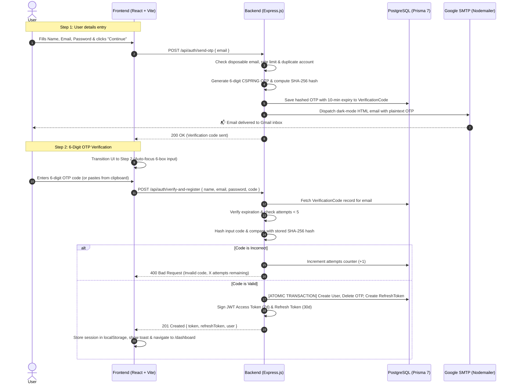

# 📧 Complete Guide: Production Email OTP Verification & Security Architecture

This comprehensive guide explains the end-to-end architecture, cryptography, security protocols, database design, and frontend implementation of the **Email OTP Verification System** built for the DSA Preparation Platform.

---

## 📑 Table of Contents

1. [Architecture &amp; Workflow Overview](#1-architecture--workflow-overview)
2. [Why Pre-Registration Verification?](#2-why-pre-registration-verification)
3. [Database Architecture &amp; Schema Design](#3-database-architecture--schema-design)
4. [Cryptographic Security Deep Dive](#4-cryptographic-security-deep-dive)
   - [CSPRNG vs Math.random()](#csprng-vs-pseudorandom)
   - [SHA-256 Code Hashing at Rest](#sha-256-code-hashing-at-rest)
   - [Brute-Force Lockout (Max 5 Attempts)](#brute-force-lockout-max-5-attempts)
   - [Atomic Database Transactions](#atomic-database-transactions)
   - [Disposable &amp; Temporary Email Filtering](#disposable--temporary-email-filtering)
   - [XSS &amp; Input Sanitization](#xss--input-sanitization)
5. [SMTP Transport Layer &amp; Dev Fallback](#5-smtp-transport-layer--dev-fallback)
6. [Backend API Endpoints (Step-by-Step)](#6-backend-api-endpoints-step-by-step)
7. [Frontend Architecture &amp; UI State Machine](#7-frontend-architecture--ui-state-machine)
   - [6-Box Segmented OtpInput Component](#6-box-segmented-otpinput-component)
   - [Timer &amp; Cooldown Logic](#timer--cooldown-logic)
8. [Google OAuth vs Email Flow Matrix](#8-google-oauth-vs-email-flow-matrix)
9. [Production Scaling Checklist](#9-production-scaling-checklist)

---

## 1. Architecture & Workflow Overview

The system uses a **2-step verified pre-registration model**:



---

## 2. Why Pre-Registration Verification?

| Approach                   | Traditional Post-Registration Verification                                | Our Pre-Registration Verification (Selected)                               |
| :------------------------- | :------------------------------------------------------------------------ | :------------------------------------------------------------------------- |
| **How it works**     | Creates unverified user in DB immediately, sends verification link.       | Verifies ownership**before** creating the user record in PostgreSQL. |
| **Database Hygiene** | ❌ DB gets polluted with abandoned/bot junk accounts that never verified. | ✅ Zero orphaned or fake accounts in the database.                         |
| **User Experience**  | ❌ User has to leave the tab, click a link, get redirected, and re-login. | ✅ Seamless 6-box in-page OTP entry without ever leaving the flow.         |
| **Security Risk**    | ❌ Attackers can fill up usernames/emails with unverified ghost records.  | ✅ Email ownership is strictly proven before identity provisioning.        |

---

## 3. Database Architecture & Schema Design

In [`backend/prisma/schema.prisma`](<file:///home/a-raghavendra/Desktop/github_repos/Project%20DSA/backend/prisma/schema.prisma>):

```prisma
// Stores 6-digit OTP verification codes for email signup.
// Auto-expires after 10 minutes.
model VerificationCode {
  id        Int      @id @default(autoincrement())
  email     String
  code      String   // Stored as a SHA-256 cryptographic hash
  attempts  Int      @default(0) // Brute-force protection: max 5 attempts
  expiresAt DateTime
  createdAt DateTime @default(now())

  @@index([email])
}
```

### Key Design Decisions:

1. **`@@index([email])`**: B-Tree index on `email` ensures $O(\log n)$ lookup speeds even if millions of OTP records exist.
2. **`attempts` column**: Tracks failed attempts per verification session for automatic brute-force lockout.
3. **Short TTL (`expiresAt`)**: Strict 10-minute expiry enforces quick consumption.

---

## 4. Cryptographic Security Deep Dive

### CSPRNG vs Pseudorandom

- ❌ **Insecure Approach**: `Math.floor(100000 + Math.random() * 900000)` relies on the V8 engine's `xorshift128+` algorithm. If an attacker observes previous random values, they can reconstruct internal generator states and predict future OTPs.
- ✅ **Our Implementation**:
  ```javascript
  const crypto = require('crypto');
  const rawOtp = crypto.randomInt(100000, 1000000).toString();
  ```

  `crypto.randomInt` connects directly to Linux kernel entropy pools (`/dev/urandom`), guaranteeing cryptographic unpredictability.

---

### SHA-256 Code Hashing at Rest

- ❌ **Vulnerability in Basic Apps**: Storing plaintext codes (e.g. `"482910"`) directly in the database. If the database backup is leaked, or an SQL injection occurs, all pending OTPs are instantly compromised.
- ✅ **Our Implementation**:
  ```javascript
  function hashOtp(code) {
    return crypto.createHash('sha256').update(code.trim()).digest('hex');
  }
  ```

  Only the **256-bit cryptographic digest** is written to PostgreSQL. When the user enters their code, the server hashes the input and compares digests. The database itself never knows the raw code.

---

### Brute-Force Lockout (Max 5 Attempts)

A 6-digit OTP has $1,000,000$ possible combinations ($10^6$). An automated bot could theoretically guess $100$ codes per second.
To neutralize this:

1. Every failed guess increments `attempts` by $1$.
2. The remaining attempts count is returned to the user (`"Invalid code. 4 attempts remaining."`).
3. If `attempts >= 5`, the code is **immediately destroyed from the database**, returning HTTP 429 (`TOO_MANY_ATTEMPTS`). The attacker cannot try the remaining 999,995 combinations.

---

### Atomic Database Transactions

To eliminate race conditions (e.g. an attacker issuing parallel requests to consume a single OTP multiple times):

```javascript
const result = await prisma.$transaction(async (tx) => {
  const user = await tx.user.create({ ... });
  await tx.verificationCode.deleteMany({ where: { email: normalizedEmail } });
  const refreshToken = await tx.refreshToken.create({ ... });
  return { user, accessToken, refreshToken };
});
```

PostgreSQL executes this as an atomic ACID transaction. If any step fails, the entire transaction rolls back cleanly.

---

### Disposable & Temporary Email Filtering

To prevent malicious users or automated bots from spamming accounts with 10-minute disposable mailboxes, incoming emails are validated against a domain blocklist:

```javascript
const DISPOSABLE_DOMAINS = new Set([
  'tempmail.com', '10minutemail.com', 'guerrillamail.com', 'mailinator.com',
  'throwawaymail.com', 'temp-mail.org', 'sharklasers.com', 'yopmail.com', ...
]);
```

---

### XSS & Input Sanitization

User names are sanitized to prevent Stored Cross-Site Scripting (XSS) before reaching the database:

```javascript
function sanitizeText(str) {
  return str.replace(/<[^>]*>?/gm, '').trim();
}
```

---

## 5. SMTP Transport Layer & Dev Fallback

In [`backend/src/lib/mailer.js`](<file:///home/a-raghavendra/Desktop/github_repos/Project%20DSA/backend/src/lib/mailer.js>):

### 1. Dedicated Gmail Transport

```javascript
if (host.includes('gmail')) {
  transporter = nodemailer.createTransport({
    service: 'gmail',
    auth: { user: process.env.SMTP_USER, pass: process.env.SMTP_PASS },
  });
}
```

Using `service: 'gmail'` allows Nodemailer to automatically handle Google's TLS/SSL handshakes, ports (465/587), and connection pooling.

### 2. Developer Fallback Console Output

During local development, the backend prints the OTP code directly to the terminal:

```text
======================================================
🔑 [EMAIL OTP] To: user@example.com
👉 Verification Code: 482910 (Valid for 10 min)
======================================================
```

If an offline developer or test environment cannot reach Google SMTP, the system falls back gracefully so engineers can test signups with zero roadblocks.

---

## 6. Backend API Endpoints (Step-by-Step)

### `POST /api/auth/send-otp`

- **Purpose**: Generates and emails an OTP for account creation.
- **Validations**:
  - Valid RFC 5322 email syntax.
  - Rejects disposable domains.
  - Checks if user is already registered in DB.
  - 40-second cooldown per email address.
- **Response**: `{ success: true, message: "Verification code sent to your email address." }`

### `POST /api/auth/resend-otp`

- **Purpose**: Generates a fresh code if previous code was lost or expired.
- **Validations**: Same as `send-otp`, resets attempts to `0` and generates new 10-min expiry.

### `POST /api/auth/verify-and-register`

- **Purpose**: Validates the 6-digit code, hashes password with `bcrypt` (cost factor 10), creates user, creates refresh token, returns active JWT session.

---

## 7. Frontend Architecture & UI State Machine

### 6-Box Segmented `OtpInput` Component

Located in [`frontend/src/components/ui/OtpInput.jsx`](<file:///home/a-raghavendra/Desktop/github_repos/Project%20DSA/frontend/src/components/ui/OtpInput.jsx>):

```jsx
<OtpInput
  value={otp}
  onChange={(val) => { setOtp(val); setError(''); }}
  onComplete={(val) => handleVerifyAndRegister(val)}
  disabled={loading || expirySeconds <= 0}
  length={6}
  autoFocus
/>
```

#### Key UX Features:

1. **Auto-Advance**: Typing digit `index` focuses `index + 1` automatically.
2. **Backspace Auto-Retreat**: Pressing backspace on an empty box jumps to the previous box and clears it.
3. **Smart Clipboard Paste**: Pasting formatted strings like `482-910` or `482 910` automatically strips non-digits and fills all 6 inputs.
4. **Mobile Keypad**: `inputMode="numeric"` summons the number pad on iOS/Android.

### Timer & Cooldown Logic

In [`frontend/src/pages/Register.jsx`](<file:///home/a-raghavendra/Desktop/github_repos/Project%20DSA/frontend/src/pages/Register.jsx>):

- **10-minute countdown (`expirySeconds`)**: Updates every second. When it reaches `0`, the input is locked with `⚠️ Code Expired`.
- **45-second cooldown (`resendCooldown`)**: Prevents UI button spamming with a countdown ticker (`Resend in 32s`).

---

## 8. Google OAuth vs Email Flow Matrix

```
                      ┌─────────────────────────────────┐
                      │    User Registration Method     │
                      └────────────────┬────────────────┘
                                       │
                    ┌──────────────────┴──────────────────┐
                    ▼                                     ▼
        [ Google 1-Click OAuth ]               [ Email & Password ]
                    │                                     │
                    ▼                                     ▼
      Google verifies identity               Send 6-Digit OTP to Inbox
                    │                                     │
                    ▼                                     ▼
        Bypasses OTP verification             User enters 6-digit OTP
                    │                                     │
                    ▼                                     ▼
        DB User Created & Logged In           DB User Created & Logged In
```

- **Why Google OAuth skips OTP**: Google has already authenticated the user's email address and identity via OAuth 2.0 OpenID Connect (`sub`, `email_verified: true`). Forcing a Google user to enter an email OTP would be redundant friction.

---

## 9. Production Scaling Checklist

When moving from development to enterprise production:

| Item                             | Recommendation                                                                                                                                                                         |
| :------------------------------- | :------------------------------------------------------------------------------------------------------------------------------------------------------------------------------------- |
| **Email Service Provider** | Replace Gmail SMTP with**Resend**, **SendGrid**, or **Amazon SES** for high-volume transactional delivery (>10,000 emails/day) and custom domain DKIM/SPF alignment. |
| **Redis Rate Limiting**    | Use Redis for distributed rate limiting if backend runs on multiple load-balanced containers.                                                                                          |
| **Prisma Cleanup Cron**    | Run a nightly cron job`DELETE FROM "VerificationCode" WHERE "expiresAt" < NOW()` to clean up expired unconsumed OTP records.                                                         |

---

*Authored for the DSA Preparation Platform Architecture Documentation.*
