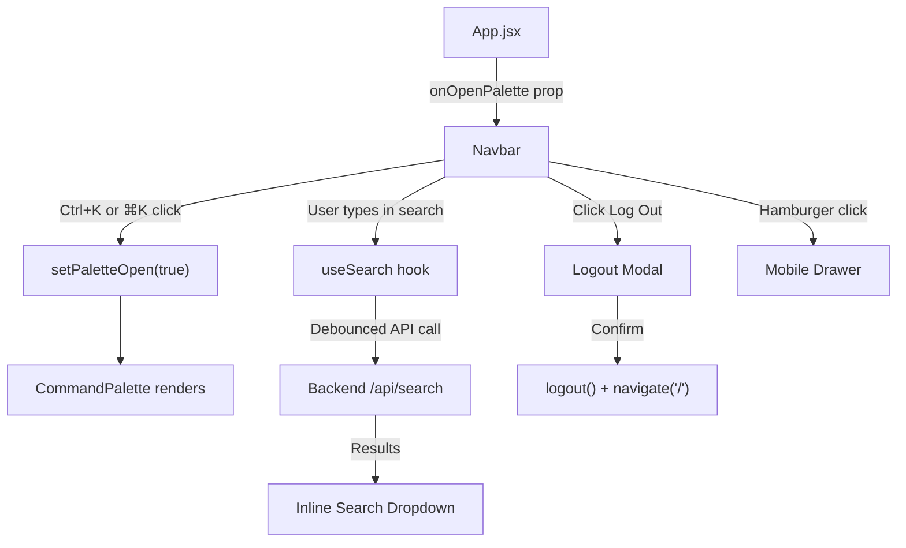

# Navbar Component — Explained

> [!NOTE]
> File: [`Navbar.jsx`](file:///home/a-raghavendra/Desktop/github_repos/Project%20DSA/frontend/src/components/layout/Navbar.jsx) — 461 lines

---

## Overview

The Navbar is the main navigation bar for the DSA Prep Platform. It handles desktop navigation links, a live inline search, a user profile dropdown, a mobile hamburger drawer, a logout confirmation modal, and a wired-up Command Palette trigger.

---

## Imports (L1–12)

| Import | Purpose |
|---|---|
| `useState, useEffect, useRef, useCallback` | React hooks for state, side effects, DOM refs, memoized functions |
| `Link, NavLink, useNavigate` | React Router — navigation links and programmatic navigation |
| [`useAuth`](file:///home/a-raghavendra/Desktop/github_repos/Project%20DSA/frontend/src/hooks/useAuth.js) | Custom hook to get `user` object and `logout` function |
| Lucide icons (`Code2, Menu, X, Search`, etc.) | UI icons used throughout the navbar |
| [`useSearch`](file:///home/a-raghavendra/Desktop/github_repos/Project%20DSA/frontend/src/hooks/useSearch.js) | Custom hook — TanStack Query-powered search with 280ms debouncing |
| [`LeetCodeIcon`](file:///home/a-raghavendra/Desktop/github_repos/Project%20DSA/frontend/src/components/ui/LeetCodeIcon.jsx) | Custom icon component for question search results |
| [`Modal`](file:///home/a-raghavendra/Desktop/github_repos/Project%20DSA/frontend/src/components/ui/Modal.jsx) | Reusable modal component (used for logout confirmation) |
| [`Navbar.css`](file:///home/a-raghavendra/Desktop/github_repos/Project%20DSA/frontend/src/components/layout/Navbar.css) | Styles for the navbar |

---

## Props

```jsx
export default function Navbar({ onOpenPalette }) { ... }
```

| Prop | Type | Description |
|---|---|---|
| `onOpenPalette` | `() => void` | Callback from [`App.jsx`](file:///home/a-raghavendra/Desktop/github_repos/Project%20DSA/frontend/src/App.jsx#L59) that opens the [`CommandPalette`](file:///home/a-raghavendra/Desktop/github_repos/Project%20DSA/frontend/src/components/ui/CommandPalette.jsx) overlay |

---

## State & Refs (L14–24)

| Name | Type | Purpose |
|---|---|---|
| `menuOpen` | `boolean` | Mobile hamburger drawer open/closed |
| `dropdownOpen` | `boolean` | User profile dropdown open/closed |
| `searchOpen` | `boolean` | Inline search results dropdown visible/hidden |
| `logoutModalOpen` | `boolean` | Logout confirmation modal visible/hidden |
| `dropdownRef` | `ref` | Detects clicks outside user dropdown to auto-close |
| `searchRef` | `ref` | Detects clicks outside search area to auto-close |
| `searchInputRef` | `ref` | Focuses the search input programmatically (e.g., on `Ctrl+K`) |

---

## Side Effects (L26–78)

### 1. `useSearch` Hook (L26–32)
Connects to the backend search API via TanStack Query. Returns:
- `searchQuery` / `setSearchQuery` — the current search term
- `searchResults` — `{ questions, topics, companies }`
- `searchLoading` — boolean loading state

### 2. Click Outside Handler (L34–46)
Listens for `mousedown` on `document`. If the click target is **outside** the dropdown or search ref, closes them automatically.

### 3. Keyboard Shortcuts (L48–66)
- **`Ctrl+K` / `Cmd+K`** → Focuses the search input and opens the search dropdown
- **`Escape`** → Closes everything (dropdown, menu, search), clears query, blurs input

### 4. Body Scroll Lock (L68–78)
When mobile drawer is open → `document.body.style.overflow = 'hidden'` to prevent background scrolling. Resets on close or unmount.

---

## Handler Functions (L80–122)

| Function | Lines | What it does |
|---|---|---|
| `handleSearchInput` | L81–85 | Updates query on each keystroke, opens search dropdown |
| `clearSearch` | L87–90 | Clears the query string and closes the search dropdown |
| `handleResultClick` | L92–95 | Navigates to the selected result's path, then clears search |
| `handleSearchSubmit` | L97–103 | On form submit (Enter), navigates to `/search?q=...` if ≥2 chars |
| `handleLogout` | L106–110 | Closes menus, opens the logout **confirmation modal** |
| `confirmLogout` | L113–117 | Actually calls `logout()`, then navigates to `/` |

---

## Rendered UI Structure (L124–453)

### 1. Brand Logo (L131–136)
```jsx
<Link to="/" className="navbar-brand">
  <Code2 /> DSAPrep
</Link>
```
Logo on the left — clicking it navigates to the home page.

---

### 2. Desktop Nav Links (L140–155)
```
Companies → /companies
Topics    → /topics
Dashboard → /dashboard  (only visible if user is logged in)
```
Uses `<NavLink>` for active-state styling.

---

### 3. Inline Search Bar (L158–263)

```
┌──────────────────────────────────────────┐
│ 🔍  Quick Search...               ⌘K    │
└──────────────────────────────────────────┘
         │                            │
         │                            └── Clickable button → opens Command Palette
         │
         └── On type (≥2 chars) → shows dropdown:
              ┌─────────────────────────────┐
              │ Questions                   │
              │   • Two Sum          Easy   │
              │   • 3Sum             Medium │
              │ Companies                   │
              │   • Google     150 problems │
              │ Topics                      │
              │   • Arrays     45 problems  │
              │ ───────────────────────────│
              │ View all results for "..."  │
              └─────────────────────────────┘
```

- **Loading state**: Shows a spinner while fetching
- **Empty state**: "No results for ..."
- **⌘K badge**: Now a `<button>` that calls `onOpenPalette()` to open the full Command Palette

---

### 4. Right Side — Auth Section (L263–324)

**When logged in:**
```
┌───────────────────────┐
│  [R] Raghavendra  ▾   │  ← avatar + name + chevron
└───────────────────────┘
         │
         └── Dropdown:
              • Dashboard
              • Bookmarks
              • Profile Settings
              ──────────
              • Log Out
```

**When logged out:**
```
[ Log In ]  [ ✨ Get Started ]
```

**Mobile hamburger** toggle button (visible on small screens).

---

### 5. Mobile Drawer (L328–393)

Slides in from the side when the hamburger is tapped.

```
┌─────────────────────┐
│ Navigation           │
│   • Companies        │
│   • Topics           │
│   • Dashboard        │
│                      │
│ Account (Username)   │
│   • Bookmarks        │
│   • Profile          │
│   • Log Out          │
└─────────────────────┘
```

- Has a semi-transparent **backdrop** — tapping it closes the drawer
- Body scroll is locked while open

---

### 6. Logout Confirmation Modal (L398–452)

A `<Modal>` dialog shown before logging out:

```
┌──────────────────────────────────┐
│  🔓 Sign out of DSA Prep?       │
│                                  │
│  You will need to sign back in   │
│  to access your dashboard and    │
│  bookmarks.                      │
│                                  │
│  [R] Raghavendra                 │
│      raghavendra@email.com       │
│                                  │
│  ✅ Progress is saved in cloud   │
│                                  │
│  [ Cancel ]  [ 🔓 Sign Out ]    │
└──────────────────────────────────┘
```

---

## Data Flow Diagram



---

## Two Search Experiences

| Feature | Inline Search (Navbar) | Command Palette |
|---|---|---|
| **Trigger** | Click/focus the search input | `Ctrl+K` / click ⌘K badge |
| **UI** | Small dropdown under the search bar | Full-screen overlay portal |
| **Keyboard nav** | No | ↑↓ to navigate, Enter to open |
| **Quick actions** | No | Yes (Companies, Topics, Dashboard, etc.) |
| **Managed by** | Navbar itself | [`App.jsx`](file:///home/a-raghavendra/Desktop/github_repos/Project%20DSA/frontend/src/App.jsx) + [`CommandPalette.jsx`](file:///home/a-raghavendra/Desktop/github_repos/Project%20DSA/frontend/src/components/ui/CommandPalette.jsx) |
